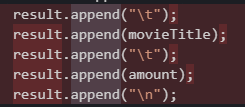
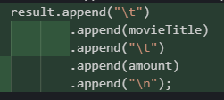
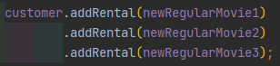

Video Store
==========

> *The videostore example from Martin Fowler's Refactoring, and from Episode 3 of cleancoders.com*

<!-- toc -->

- [Auteur](#auteur)
- [Statistiques](#statistiques)
- [Descriptif](#descriptif)
- [Dépôts github](#dépôts-github)

<!-- tocstop -->

# Auteur

[Noé LARRIEU-LACOSTE](https://github.com/Nouuu)  

Classe 3AL2

# Statistiques

Cette partie, au tout début du README.md, devra résumer le nombre de code smells détectés ainsi que le nombre de
techniques de refactoring appliquées.

| Code smells détectés | Nombre de techniques de refactoring appliquées |
| :------------------: | :--------------------------------------------: |
|          14          |                       19                       |

# Descriptif

Cette partie contiendra un tableau (ou une liste) avec, pour chaque ligne :

- Le code smell détecté
- La ou les technique(s) de refactoring appliquées
- Le ou les bénéfice(s) apporté par ce correctif

| Code smell détecté                                           | Technique(s) appliquées                                      | Bénéfice(s) apporté                                          |
| ------------------------------------------------------------ | :----------------------------------------------------------- | ------------------------------------------------------------ |
| Déclaration des attributs de classes tout en bas du code     | Déplacement des déclarations des attributs tout en haut de la classe. | Une meilleure lisibilité pour le développeur                 |
| Vecteur et Énumération contenant les locations non typés     | Typage du vecteur et de l'énumération : `Vector rentals` :arrow_right:`Vector<Rental> rentals` | Permet de s'assurer que les éléments de ce vecteur / cette énumération sont bien des objets du type `Rental` |
|                                                              | Retirer les `casts` au moment de la récupération d'un élément dans une énumération | L'énumération étant maintenant typé, il n'est plus nécessaire de `cast` son type |
| Attributs initialisés mais jamais changés ensuite            | Passage des attributs initialisé une seulement en attributs `final` | On s'assure qu'un attribut n'étant censé être seulement initialisé ne sera pas modifié par la suite |
| Concaténation d'une chaine de caractères à la "chaine"       | Utilisation de l'objet `StringBuilder`                       | Légère amélioration des performances et manipulation de la chaine de caractère en cours de construction plus simple |
|                                                              | `StringBuilder`avec des `append` à la chaine                 |  Deviens  |
| Déclaration des différents type de film (**CHILDRENS, REGULAR, NEW_RELEASE**) à l'intérieur de la classe `Movie` en `static final` | Création de `enum MovieType` pour stocker les différents `priceCode` de l'objet `Movie` et retirer les attributs présent dans `Movie ` en `static final` | Permet de factoriser le code et dissocier les types de films de l'objet `Movie`. On a ainsi une meilleure lisibilité du code |
|                                                              | Refactorisation de tout le code pour prendre en charge `enum MovieType` |                                                              |
| La méthode `statement` dans l'objet `Customer` est trop grande et peut être grandement factorisé | Création d'une nouvelle classe RentalStatement déplacement de la méthode `statement` dedans. (Refactorisation implicite de la méthode présente dans la classe `Customer` pour appeler la nouvelle méthode) | Une meilleure lisibilité et permet de gérer le `Statement` indépendamment du `Customer`. |
| Les variables de la méthode `Statement` son locales à la méthode | Les variables de cette méthode son maintenant globales à la classe | Cela va nous permettre, au moment de refactoriser cette méthode avec des méthodes intermédiaires, d'avoir accès à ces variables. |
| La méthode `statement` fait beaucoup trop de traitements différents et mérite une meilleure lisibilité | Création de la méthode `processRental`                       | Retire un traitement en trop de la méthode `statement`, qui maintenant se contentera d'appeler `processRental` à la place pour le calcul de point de chaque location |
| `processRental` fait trop de traitements, notamment celui d'ajouter les points de fréquentation à la fin | Création de la méthode `appendFrequentRenterPoints`          | Retire un traitement en trop de la méthode `statement`, qui maintenant se contentera d'appeler `appendFrequentRenterPoints` à la place pour ajouter à la chaine de caractère final le nombre de points de fréquentation |
| `processRental` s'occupe de beaucoup de chose, notamment de remplir la chaine de caractère avec les informations du `Rental` | Création de la méthode `appendRentalDetails`                 | Retire un traitement en trop de la méthode `processRental`, qui maintenant se contentera d'appeler `appendFrequentRenterPoints` à la place pour ajouter à la chaine de caractère final le détail d'une location |
|                                                              | Renommage de la méthode `statement` en `rentalStatement`     | Plus cohérent à mon sens                                     |
| Le switch case pour calculer les différents taux de Rental selon le type de Movie est assez illisible et peu maintenable | Séparation du calcul `rentalAmount` selon les différents type de `Movie` (**CHILDRENS, REGULAR, NEW_RELEASE**) séparés dans plusieurs méthodes : `getRegularRentalAmount`, `getNewReleaseRentalAmount`, `getChildrenRentalAmount` | Cela permet un bien meilleur contrôle si il faut un jour modifier ce qu'apporte un type de `Movie`, où même pour faire évoluer la fonctionnalité et rajouter des nouveaux types |
| Chaque fois que l'on veut faire un nouveau `Statement`, avec le code actuel il faudrait recréer un objet `RentalStatement` | Création de la méthode `newRentalStatement` qui initialise / réinitialise l'état de `RentalStatement` | Permet grâce à une méthode de remettre à 0 l'état de `rentalStatement` sans avoir à créer un nouvel objet |
| Certains type de `Movie` ont des points bonus, d'autres non pour le moment, et tout ça est mélangé au restes des traitements. | Création de la méthode `getFrequentRenderPoints`             | On factorise encore plus notre code de cette manière et cela permettra si il y a une évolution de facilement rajouter des bonus plus spécifiques |
|                                                              | La méthode `addRental`dans a classe `Customer`retourne désormais lui même `this` | Permettra d'ajouter des `Rental` à la chaine de cette manière  |
| Les tests unitaire sont un peu en désordre et mériterais une meilleure lisibilité, flexibilité | Refactorisation des tests unitaires, les tests restent les mêmes mais tout les paramètres spécifiques utilisés sont maintenant déclarés au début des tests et sont hautement personnalisables | Cela évite la confusion, et de recréer un objet à chaque tests alors que certains utilisent les mêmes objets |

# Dépôts GitHub

Dépôt du projet : https://github.com/Nouuu/videostore

Dépôt original utilisé pour exercice : https://github.com/unclebob/videostore